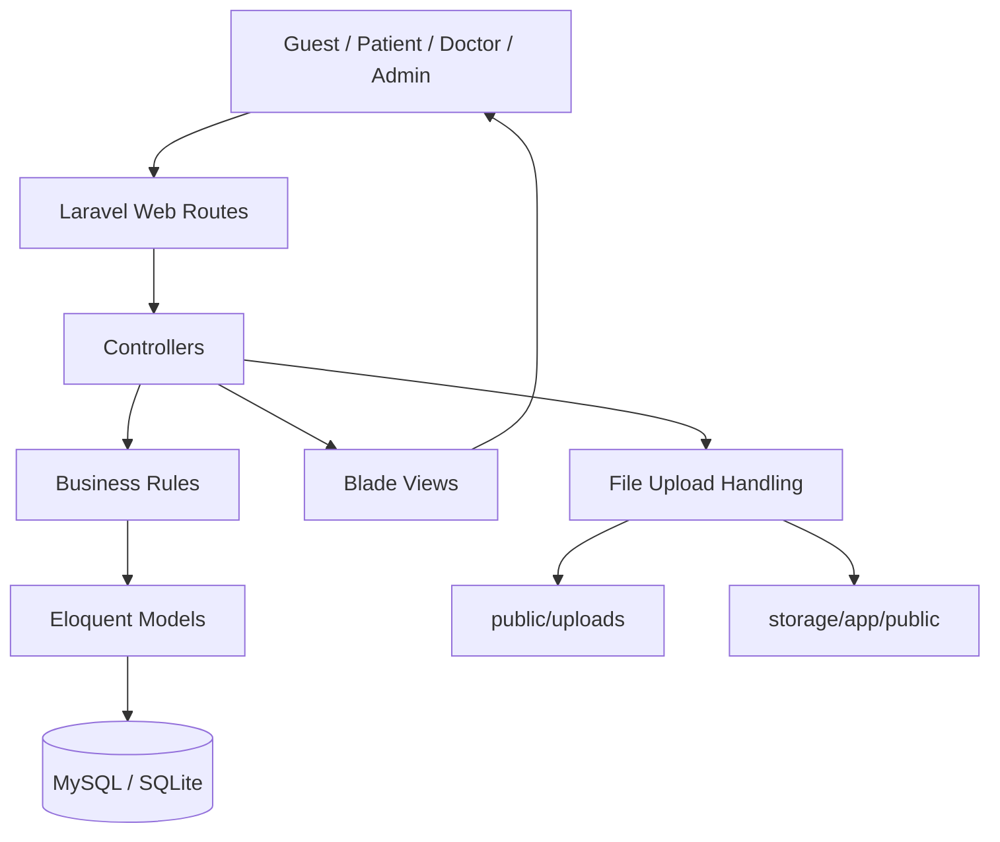
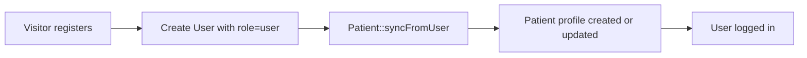
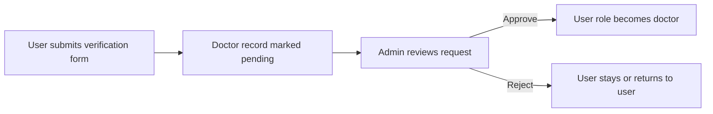
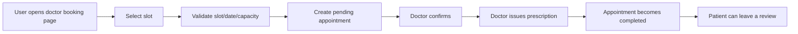

# MediConnect

> Comprehensive system documentation for the **MediConnect** medical appointment booking and management platform.  
> This README is written to be readable on GitHub and detailed enough for onboarding, maintenance, and future development.

---

## Table of Contents

- [1. Project Overview](#1-project-overview)
- [2. Business Goals](#2-business-goals)
- [3. Technology Stack](#3-technology-stack)
- [4. High-Level Architecture](#4-high-level-architecture)
- [5. User Roles and Permissions](#5-user-roles-and-permissions)
- [6. Main Functional Modules](#6-main-functional-modules)
- [7. End-to-End Business Flows](#7-end-to-end-business-flows)
- [8. Project Structure](#8-project-structure)
- [9. Domain Model Summary](#9-domain-model-summary)
- [10. Key Routes Overview](#10-key-routes-overview)
- [11. Installation and Local Setup](#11-installation-and-local-setup)
- [12. Demo and Seeded Accounts](#12-demo-and-seeded-accounts)
- [13. File Upload and Storage Paths](#13-file-upload-and-storage-paths)
- [14. Current Testing Status](#14-current-testing-status)
- [15. Known Limitations and Technical Notes](#15-known-limitations-and-technical-notes)
- [16. Recommended Next Improvements](#16-recommended-next-improvements)
- [17. Maintenance Notes](#17-maintenance-notes)
- [18. Summary](#18-summary)

---

## 1. Project Overview

**MediConnect** is a Laravel-based medical appointment booking and healthcare management system.

It combines:

- a public-facing healthcare website
- patient account management
- doctor verification and scheduling
- appointment booking and lifecycle management
- prescription issuance
- doctor reviews
- administrative management of operational data

### Application type

- **Architecture style:** monolithic Laravel web application
- **Rendering approach:** server-rendered Blade templates
- **Frontend model:** not a SPA, no dedicated public API layer in the current codebase
- **Primary focus:** web-based internal/public healthcare workflow management

### Snapshot facts from the current codebase

| Item | Current value |
|---|---:|
| Controllers | 22 |
| Models | 15 |
| Migrations | 31 |
| Blade view files | 59 |
| Main route definitions in `routes/web.php` | ~86 |
| Primary roles | 3 (`user`, `doctor`, `admin`) |

---

## 2. Business Goals

The system is designed to support the following goals:

1. **Provide public healthcare information**
   - homepage
   - about page
   - services page
   - blog listing and blog detail

2. **Support patient self-service**
   - registration and login
   - profile management
   - avatar upload
   - appointment booking
   - appointment tracking
   - doctor review submission

3. **Support doctor workflow**
   - doctor verification and approval
   - schedule management
   - appointment review and handling
   - prescription creation
   - consultation completion

4. **Support administrative control**
   - doctor approval and status control
   - specialty management
   - patient and staff management
   - appointment oversight
   - medication catalog management
   - blog management
   - location data management

---

## 3. Technology Stack

### Backend

- **PHP:** `^8.3`
- **Framework:** Laravel `^13.0`
- **ORM:** Eloquent
- **Auth model:** built on Laravel authentication
- **Template engine:** Blade

### Frontend

- **Build tool:** Vite `^8.0.0`
- **CSS:** Tailwind CSS `^4.0.0`
- **HTTP utility:** Axios
- **UI style:** server-rendered pages with Blade views and static assets

### Development and QA tools

- **PHPUnit:** `^12.5.12`
- **Laravel Pint**
- **Laravel Pail**
- **concurrently**

---

## 4. High-Level Architecture



### Architectural notes

- The application is organized around standard Laravel MVC patterns.
- Most business logic currently lives in **controllers and models**.
- There is **no dedicated API layer** yet.
- Location validation is handled through a dedicated **`LocationService`**.
- Authentication and role-based access are enforced through Laravel middleware and route grouping.
- File storage is split between:
  - `public/uploads/...`
  - `storage/app/public/...`

---

## 5. User Roles and Permissions

The system stores role information in `users.role`.

### Roles

| Role | Purpose |
|---|---|
| `user` | Standard patient-facing account |
| `doctor` | Approved doctor account |
| `admin` | Administrator account |

### Permission summary

| Capability | Guest | User | Doctor | Admin |
|---|:---:|:---:|:---:|:---:|
| View homepage/about/services | ✅ | ✅ | ✅ | ✅ |
| View blog list | ✅ | ✅ | ✅ | ✅ |
| View blog detail | ❌* | ✅ | ✅ | ✅ |
| Register / log in | ✅ | ✅ | ✅ | ✅ |
| Manage own profile | ❌ | ✅ | ✅** | ✅** |
| Upload avatar | ❌ | ✅ | ✅** | ✅** |
| Submit doctor verification | ❌ | ✅ | ❌ | ❌ |
| Browse doctors | ✅ | ✅ | ✅ | ✅ |
| Book appointment | ❌ | ✅ | ❌ | ❌ |
| View own appointments | ❌ | ✅ | ❌ | ❌ |
| Manage doctor schedules | ❌ | ❌ | ✅ | ❌ |
| Confirm / cancel own doctor appointments | ❌ | ❌ | ✅ | ✅ |
| Create prescriptions | ❌ | ❌ | ✅ | ❌ |
| Approve doctors | ❌ | ❌ | ❌ | ✅ |
| Manage specialties, patients, blogs, medications | ❌ | ❌ | ❌ | ✅ |

\* Blog detail route is currently protected by `auth`.  
\** Access depends on the authenticated account, but profile pages are primarily built for user-facing flows.

### Middleware behavior

- **Admin routes** use:
  - `auth`
  - `App\Http\Middleware\AdminMiddleware`

- `AdminMiddleware`:
  - redirects guests to login
  - blocks non-admin users
  - redirects blocked users to the user dashboard with an error message

### Important role rule

A user does **not** become a doctor immediately after submitting doctor verification documents.

The sequence is:

1. user submits doctor verification request
2. system stores request as **pending**
3. admin approves or rejects
4. role changes to `doctor` **only after approval**

---

## 6. Main Functional Modules

### 6.1 Public Pages

#### Public routes

- `/`
- `/about`
- `/services`
- `/blog`
- `/blog/{slug}`

#### Current behavior

- Homepage shows:
  - featured blogs
  - featured approved doctors
  - recent doctor feedback
- If the authenticated user lands on `/`:
  - `doctor` is redirected to the doctor dashboard
  - `user` is redirected to the user dashboard
- Blog detail currently requires authentication.

#### Blog data source

The blog system supports:

- database-backed blog posts
- **3 hardcoded fallback blog posts** in `App\Models\Blog`

This means the blog UI still has content even if the database is empty.

---

### 6.2 Authentication and Account Management

#### Registration

The registration flow creates a new `users` row with:

- full name
- email
- phone
- gender
- province
- district
- ward
- address detail
- date of birth
- password

Then the system automatically synchronizes a patient profile using:

```php
Patient::syncFromUser($user);
```

#### Login

Successful login redirects by role:

| Role | Redirect |
|---|---|
| `admin` | `/admin` |
| `doctor` | doctor dashboard |
| `user` | user dashboard |

#### Forgot password flow

The current forgot password flow is:

1. enter registered email
2. receive a generated OTP
3. verify OTP
4. set a new password

**Important:**  
The OTP is currently a **demo/session-based implementation**. It is generated and flashed back to the UI, not sent through a real email service. This is acceptable for demo/development purposes, but should be upgraded before production release.

---

### 6.3 User Profile Module

#### Main features

- view profile information
- update account information
- change password
- upload avatar
- view current-week appointments
- view completed appointments
- submit doctor verification request

#### Avatar upload behavior

- accepted formats: `jpg`, `jpeg`, `png`, `gif`, `webp`
- max size: `2 MB`
- saved to: `public/uploads/avatars`
- previous avatar file is deleted if present

#### Profile update behavior

When profile data changes, the system also runs:

```php
Patient::syncFromUser($user);
```

This keeps the patient table aligned with the user profile.

---

### 6.4 Doctor Verification Workflow

#### Submission requirements

A user requesting doctor verification must provide:

- doctor full name
- date of birth
- citizen ID number
- doctor phone number
- degree(s)
- specialty
- years of experience
- city (optional)

#### Required uploads

- citizen ID front image
- citizen ID back image
- degree image

#### Storage behavior

Verification files are stored on the public disk under:

```text
storage/app/public/doctor-verifications
```

#### Result of submission

The system:

- creates or updates the `doctors` row
- sets:
  - `approval_status = pending`
  - `verification_status = pending`
  - `submitted_at = now()`
- updates the user row:
  - `doctor_verification_status = pending`

#### Approval behavior

When admin approves:

- doctor approval status becomes `approved`
- user role becomes `doctor`
- user verification fields are updated to approved
- doctor becomes active

When admin rejects:

- doctor approval status becomes `rejected`
- user role reverts/remains `user`
- rejection reason can be stored in `approval_note`

---

### 6.5 Doctor Discovery and Booking

#### Doctor listing

The doctor listing page supports:

- specialty filter
- city filter
- keyword search

#### Display rules

Only doctors meeting both conditions are shown:

- `approval_status = approved`
- `status = active`

#### Sorting behavior

The list prioritizes doctors by:

1. featured doctors
2. higher experience
3. newer records

It also calculates:

- review count
- average rating

#### Booking page behavior

The booking page:

- loads schedules for the selected doctor
- builds slots only for the next **7 days**
- excludes time slots already in the past
- calculates:
  - `booked_count`
  - `remaining_slots`
  - `is_full`

Selected booking values use the format:

```text
schedule_id|YYYY-MM-DD
```

---

### 6.6 Appointment Lifecycle

#### Booking rules

A user must be authenticated to book.

On booking, the system validates:

- `doctor_id` exists
- selected slot format is valid
- schedule belongs to the doctor
- appointment is not in the past
- appointment is within the next 7 days
- same patient does not already have the same slot unless prior appointment was cancelled
- schedule patient capacity is not exceeded

#### Appointment statuses

| Status | Meaning |
|---|---|
| `pending` | newly created booking |
| `confirmed` | doctor/admin confirmed the appointment |
| `completed` | consultation completed and prescription issued |
| `cancelled` | appointment cancelled |

#### Expired appointment cleanup

The system contains a cleanup rule:

- non-completed appointments that have already passed are considered expired
- expired records are **deleted**, not archived

This cleanup happens through:

```php
Appointment::purgeExpired();
```

It is called from multiple screens and flows.

#### Confirm / cancel rules

Only:

- the owning doctor
- or an admin

can confirm or cancel appointments.

Additional rules:

- `pending` and `confirmed` can move to `confirmed`
- `completed` cannot be cancelled
- `cancelled` cannot be completed

#### Review rules

A patient can review only if:

- they own the appointment
- appointment status is `completed`
- the appointment has not been reviewed before

Review constraints:

- rating range: `1` to `5`
- one review per appointment

---

### 6.7 Schedule Management

Approved doctors can manage schedules.

#### Supported actions

- create schedule
- update schedule
- delete schedule
- view schedule dashboard information

#### Main schedule fields

- `doctor_id`
- `start_date`
- `end_date`
- `type`
- `days`
- `start_time`
- `end_time`
- `max_patients`
- `location`
- `notes`

#### Validation rules

- `end_date >= start_date`
- `end_time > start_time`
- at least one day must be selected
- `max_patients >= 1` when provided

#### Technical note

The selected days are stored as a **comma-separated string** such as:

```text
Mon,Tue,Fri
```

This is simple and works for current business logic, but may become limiting if more advanced schedule queries are needed later.

---

### 6.8 Prescription Module

Doctors issue prescriptions for their own appointments.

#### Access rules

The appointment must:

- belong to the logged-in doctor
- not be cancelled
- be in `confirmed` or `completed` state to open the prescription page

#### Save behavior

When a prescription is saved, a database transaction:

1. updates appointment:
   - `diagnosis`
   - `doctor_advice`
   - `status = completed`
   - `completed_at = now()`
2. creates a prescription with:
   - `status = issued`
   - `issued_at = now()`
3. inserts prescription items

#### Prescription item data

Each item can contain:

- medication
- dosage
- frequency
- duration
- quantity
- instructions
- notes

#### Important business note

In this project, **completing a consultation is effectively finalized when the prescription is successfully stored**.

---

### 6.9 Blog Module

#### Public side

The blog module supports:

- blog list
- featured posts
- blog detail
- related blog suggestions

#### Admin side

Admin can:

- create blog
- edit blog
- delete blog
- upload thumbnail

#### Blog fields

- title
- slug
- excerpt
- content
- thumbnail
- status
- `is_featured`
- `published_at`

#### Blog statuses

- `draft`
- `published`

#### Publication rule

If a future `published_at` date is submitted, the controller normalizes it back to **now** instead of allowing future scheduling.

---

### 6.10 Admin Management Modules

The admin area includes the following management modules.

#### Doctor Management

- doctor listing
- filtering by keyword, specialty, status, approval status
- doctor detail screen
- doctor approval / rejection
- toggle active or inactive
- delete doctor profile
- review statistics and recent reviews

#### Specialty Management

- create, update, delete specialties
- manage `active` / `inactive`
- mark specialties as featured
- view doctor and appointment counts per specialty

#### Degree Management

This is an important implementation detail:

> The degree screen exists in the admin UI, but the actual degree list is currently **hard-coded** in `App\Models\Degree::FIXED_DEGREES`.

That means:

- the admin degree module is effectively read-only
- create/update/delete operations return an error message instructing developers to edit the code instead

Current fixed degree list:

- General Practitioner
- Master
- Doctorate

#### Patient Management

- list patients
- search by keyword
- filter by gender
- open detail page
- edit linked user profile information
- convert role between `user` and `admin`
- synchronize patient/user/staff records

Important behavior:

- if a patient-linked user is changed to role `admin`, a staff record is created or updated
- patient profile can be removed from patient-facing classification logic

#### Staff Management

- mainly reflects users with admin role
- shows search and statistics
- used as administrative personnel data

#### Location Management

- manages `location_cities`
- each city stores a `districts` JSON structure
- `LocationService` uses this table if available
- falls back to `config/locations.php` if the table is missing or inaccessible

#### Appointment Management

- list appointments
- filter by doctor, status, keyword
- open appointment detail
- inspect patient history and prescriptions

#### Medication and Medicine Type Management

- medication CRUD
- medicine type CRUD
- prevent deleting medicine types if they still have medications
- prevent deleting medications that are already referenced in prescription items

---

## 7. End-to-End Business Flows

### 7.1 User Registration and Patient Creation



### 7.2 Doctor Verification Flow



### 7.3 Appointment Booking Flow



---

## 8. Project Structure

```text
app/
├── Http/Controllers/
│   ├── Admin/
│   ├── Doctor/
│   └── User/
├── Models/
├── Providers/
└── Services/
    └── LocationService.php

config/
├── locations.php
└── ...

database/
├── migrations/
├── seeders/
└── factories/

public/
├── images/
├── uploads/
└── storage/

resources/
├── css/
├── js/
└── views/
    ├── admin/
    ├── components/
    ├── layouts/
    ├── pages/
    └── partials/

routes/
└── web.php

tests/
├── Feature/
├── Unit/
└── TestCase.php
```

### Important folders

| Path | Purpose |
|---|---|
| `app/Http/Controllers` | request handling and module-level business flow |
| `app/Models` | domain models and relationships |
| `app/Services/LocationService.php` | location normalization and validation |
| `database/migrations` | schema history |
| `database/seeders` | demo accounts and initial data |
| `resources/views` | Blade UI |
| `routes/web.php` | main route file |
| `public/uploads` | public uploads |
| `storage/app/public` | storage-backed public files |

---

## 9. Domain Model Summary

### Core models

| Model | Role in system |
|---|---|
| `User` | master authentication entity |
| `Doctor` | doctor profile and approval data |
| `Patient` | patient profile synchronized from user |
| `Staff` | administrative staff profile |
| `Specialty` | doctor specialty catalog |
| `Degree` | fixed degree definitions used during doctor verification |
| `Schedule` | doctor working schedule |
| `Appointment` | booking and consultation record |
| `AppointmentReview` | patient review after completed appointment |
| `Prescription` | issued prescription |
| `PrescriptionItem` | medication rows inside a prescription |
| `Medication` | medication catalog |
| `MedicineType` | medication grouping |
| `Blog` | blog article content |
| `LocationCity` | province/city and district/ward structure |

### Important database design note

In the **current implementation**, `appointments.patient_id` points to the **`users` table**, not the `patients` table.

That means:

- appointment ownership is user-centric
- the patient profile table acts more like a synchronized profile extension
- this should be kept in mind when adding reports or analytics later

### Main relationships

| Relationship | Type |
|---|---|
| User → Patient | one-to-one |
| User → Doctor | one-to-one |
| User → Staff | one-to-one |
| Specialty → Doctor | one-to-many |
| Doctor → Schedule | one-to-many |
| Doctor → Appointment | one-to-many |
| User(patient) → Appointment | one-to-many |
| Appointment → Prescription | one-to-many |
| Prescription → PrescriptionItem | one-to-many |
| Appointment → AppointmentReview | one-to-one |
| MedicineType → Medication | one-to-many |
| Medication → PrescriptionItem | one-to-many |

### Key tables and notable fields

#### `users`

- `full_name`
- `email`
- `phone`
- `gender`
- `province`
- `district`
- `ward`
- `address_detail`
- `dob`
- `avatar`
- `role`
- `doctor_verification_status`
- `doctor_verified_at`
- `doctor_rejection_reason`
- `password`

#### `doctors`

- `user_id`
- `specialty_id`
- `name`
- `email`
- `phone`
- `degree`
- `doctor_dob`
- `citizen_id`
- `citizen_id_front`
- `citizen_id_back`
- `degree_image`
- `license_number`
- `experience_years`
- `hospital`
- `clinic_address`
- `city`
- `bio`
- `consultation_fee`
- `schedule_text`
- `status`
- `is_featured`
- `approval_status`
- `approval_note`
- `verification_status`
- `submitted_at`
- `approved_at`
- `rejected_at`

#### `appointments`

- `patient_id`
- `doctor_id`
- `schedule_id`
- `appointment_date`
- `appointment_day`
- `start_time`
- `end_time`
- `type`
- `location`
- `max_patients`
- `status`
- `notes`
- `diagnosis`
- `doctor_advice`
- `completed_at`

#### `prescriptions`

- `appointment_id`
- `doctor_id`
- `patient_id`
- `diagnosis`
- `advice`
- `notes`
- `status`
- `issued_at`

#### `appointment_reviews`

- `appointment_id`
- `patient_id`
- `doctor_id`
- `rating`
- `review`
- `reviewed_at`

#### `location_cities`

- `name`
- `districts` (JSON)

---

## 10. Key Routes Overview

### Public

| Method | Route | Purpose |
|---|---|---|
| GET | `/` | homepage |
| GET | `/about` | about page |
| GET | `/services` | services page |
| GET | `/blog` | blog listing |
| GET | `/blog/{slug}` | blog detail |

### Authentication

| Method | Route |
|---|---|
| GET / POST | `/register` |
| GET / POST | `/login` |
| GET / POST | `/forgot-password` |
| GET / POST | `/forgot-password/otp` |
| GET | `/forgot-password/reset` |
| POST | `/forgot-password/reset` |
| POST | `/logout` |

### User and profile

| Method | Route |
|---|---|
| GET | `/user/dashboard` |
| GET | `/user/profile` |
| PUT | `/user/profile` |
| POST | `/user/profile/password` |
| POST | `/user/profile/avatar` |
| POST | `/user/profile/verify-doctor` |

### Doctor browsing and booking

| Method | Route |
|---|---|
| GET | `/doctor` |
| GET | `/doctor-list` |
| GET | `/user/doctor-list` |
| GET | `/doctor-booking/{doctor}` |
| POST | `/appointments` |

### Schedule

| Method | Route |
|---|---|
| GET | `/schedule` |
| POST | `/schedule` |
| PUT | `/schedule/{id}` |
| DELETE | `/schedule/{id}` |

### Appointment lifecycle

| Method | Route |
|---|---|
| GET | `/my-appointments` |
| GET | `/doctor-appointments` |
| PATCH | `/appointments/{appointment}/confirm` |
| PATCH | `/appointments/{appointment}/cancel` |
| PATCH | `/appointments/{appointment}/complete` |
| POST | `/appointments/{appointment}/review` |
| GET | `/appointments/{appointment}/prescriptions/create` |
| POST | `/appointments/{appointment}/prescriptions` |

### Admin

Main admin route groups include:

- `/admin/doctors`
- `/admin/doctor-approvals`
- `/admin/specialties`
- `/admin/degrees`
- `/admin/patients`
- `/admin/staffs`
- `/admin/locations`
- `/admin/appointments`
- `/admin/medications`
- `/admin/medicine-types`
- `/admin/blogs`

---

## 11. Installation and Local Setup

### 11.1 Requirements

- PHP `8.3+`
- Composer
- Node.js + npm
- MySQL or SQLite
- PHP extensions required for Laravel/PHPUnit, especially:
  - `mbstring`
  - `dom`
  - `xml`
  - `xmlwriter`
  - `json`
  - `tokenizer`
  - `libxml`

### 11.2 Setup steps

```bash
composer install
npm install
cp .env.example .env
php artisan key:generate
php artisan migrate --seed
npm run build
php artisan serve
```

For frontend development instead of a production build:

```bash
npm run dev
```

### 11.3 Useful composer scripts

```bash
composer run setup
composer run dev
composer run test
```

### What these scripts do

- `composer run setup`
  - installs dependencies
  - creates `.env` if missing
  - generates app key
  - runs migrations
  - installs npm packages
  - builds frontend assets

- `composer run dev`
  - runs Laravel server, queue listener, logs, and Vite together

- `composer run test`
  - clears config
  - runs `php artisan test`

### 11.4 Database note in this source snapshot

There is a small environment mismatch in the analyzed project snapshot:

| File | DB connection |
|---|---|
| `.env.example` | `sqlite` |
| `.env` in the uploaded snapshot | `mysql` with database `mediconnect` |

The team should standardize this for onboarding to avoid confusion.

---

## 12. Demo and Seeded Accounts

### Default admin

| Email | Password |
|---|---|
| `admin@gmail.com` | `Admin@123456` |

### Seeded doctors

| Email | Password |
|---|---|
| `doctor1@gmail.com` | `Doctor@123456` |
| `doctor2@gmail.com` | `Doctor@123456` |
| `doctor3@gmail.com` | `Doctor@123456` |
| `doctor4@gmail.com` | `Doctor@123456` |

### Seeded users

| Email | Password |
|---|---|
| `customer1@gmail.com` | `User@123456` |
| `customer2@gmail.com` | `User@123456` |

### Seeded supporting data

- **3 specialties**
  - Cardiology
  - Dermatology
  - Pediatrics
- **3 fixed degree definitions**
  - General Practitioner
  - Master
  - Doctorate
- **3 medicine types**
  - Analgesic
  - Antibiotic
  - Antihistamine
- **3 medications**
  - Paracetamol
  - Amoxicillin
  - Cetirizine

---

## 13. File Upload and Storage Paths

| Feature | Path |
|---|---|
| User avatars | `public/uploads/avatars` |
| Blog thumbnails | `public/uploads/blogs` |
| Doctor verification documents | `storage/app/public/doctor-verifications` |

### Deployment note

If files stored on the public disk need to be web-accessible, make sure to run:

```bash
php artisan storage:link
```

---

## 14. Current Testing Status

The `tests/` directory currently contains only the default Laravel example tests:

- `tests/Feature/ExampleTest.php`
- `tests/Unit/ExampleTest.php`

That means the project currently has **no real automated coverage** for:

- booking flow
- doctor approval flow
- schedule management
- prescriptions
- blog admin flow
- medication CRUD
- permissions and role separation

For the detailed QA checklist, see:

- [`TESTING_GUIDE.md`](./TESTING_GUIDE.md)

---

## 15. Known Limitations and Technical Notes

1. **Forgot password is demo-only**
   - OTP is generated in session/flash flow
   - no real email delivery is implemented yet

2. **Blog detail requires authentication**
   - route `/blog/{slug}` currently uses `auth`
   - this should be validated against product requirements

3. **Expired appointments are deleted**
   - they are not archived
   - this may cause historical reporting gaps

4. **Schedule days are stored as CSV text**
   - simple now, but less flexible for future analytics

5. **Degree management is code-driven**
   - admin degree screen exists
   - but actual degree data is hard-coded in `App\Models\Degree::FIXED_DEGREES`

6. **Appointments reference `users.id` as patient**
   - not `patients.id`
   - developers should keep this in mind when extending the schema

7. **There are duplicate-looking staff `user_id` migrations**
   - `2026_04_14_090000_add_user_id_to_staff_table.php`
   - `2026_04_14_100000_add_user_id_to_staff_table.php`
   - this should be reviewed and cleaned up over time

8. **The uploaded snapshot already includes `vendor/` and `node_modules/`**
   - that is convenient for local inspection
   - but not ideal for a clean Git repository in the long term

9. **Local CLI commands can fail if PHP extensions are missing**
   - in the inspection environment, `php artisan route:list` failed because `mbstring` was unavailable
   - `php artisan test` also failed because `dom`, `mbstring`, `xml`, and `xmlwriter` were not enabled

---

## 16. Recommended Next Improvements

### High priority

- add real Feature tests for appointment booking and prescription flows
- move more business logic from controllers into services/actions
- replace demo OTP with real email or notification delivery
- review whether blog detail should be public

### Medium priority

- archive expired appointments instead of deleting them
- add audit logs for admin actions
- add more complete seed data for realistic demos
- improve doctor search with pagination and richer filtering

### Long term

- create a dedicated API layer for mobile app or decoupled frontend use
- normalize schedule day storage
- add event/notification pipeline
- add dashboard analytics and reporting
- introduce policy classes for authorization consistency

---

## 17. Maintenance Notes

This README should be updated whenever any of the following changes:

- new modules are added
- role behavior changes
- appointment states or booking rules change
- database schema changes materially
- admin modules are added or removed
- setup requirements change
- seed accounts or credentials change
- file storage paths change

### Suggested ownership

- **Backend developers:** update business rules, routes, schema notes
- **Frontend developers:** update page/module descriptions when UI scope changes
- **QA:** update testing references and known limitations
- **Project lead:** keep onboarding and deployment notes accurate

---

## 18. Summary

MediConnect is a solid Laravel-based healthcare management system that already covers the full core workflow for a simplified clinic platform:

- user registration
- patient profile synchronization
- doctor verification
- doctor schedule management
- appointment booking
- appointment confirmation
- prescription issuance
- appointment completion
- patient review
- admin catalog and content management

The project is a strong foundation for further development, but it still needs:

- production hardening
- better automated test coverage
- cleaner separation of business logic
- more robust notification and reporting support

If maintained carefully, the current codebase can serve both as a team onboarding reference and as a good base for future expansion.
